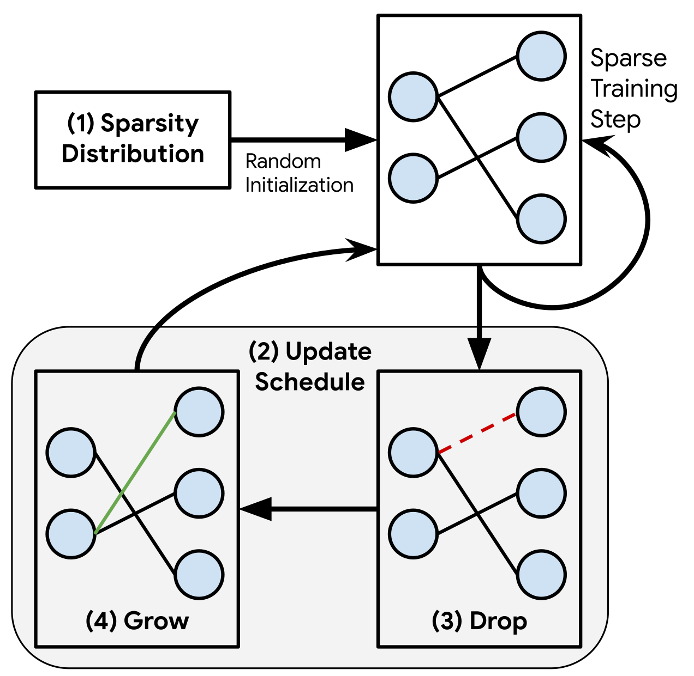

# [Reproducibilty Challenge] RigL

[Arxiv](https://arxiv.org/abs/2103.15767) | [OpenReview](https://openreview.net/forum?id=riCIeP6LzEE) | [W&B Report](https://wandb.ai/ml-reprod-2020/cifar10/reports/Reproducibility-Challenge-Rigging-the-Lottery-Making-All-Tickets-Winners--Vmlldzo1MzM0NDQ) | [W&B Training logs](https://wandb.ai/ml-reprod-2020) | [Documentation](https://varun19299.github.io/rigl-reproducibility/)

This repository hosts source code for our reproducibility report on [Rigging the Lottery: Making all Tickets Winners](https://arxiv.org/abs/1911.11134), published at ICML 2020.


<span class="img_container center" style="display: block;">
    <p align="center">
    
    <br />
    <span class="img_caption" style="display: block; text-align: center;">Figure Courtsey: Evci et al. 2020.</span>
    </p>
</span>

## Getting Started

<details><summary><b>Install</b></summary>
<p>

* `python3.8`
* `pytorch`: 1.7.0+ (GPU support preferable).

Then,

* `make install`
</p>
</details>

<details><summary><b>W&B API key</b></summary>
<p>

Copy your WandB API key to `wandb_api.key`.
Will be used to login to your dashboard for visualisation. 
Alternatively, you can skip W&B visualisation, 
and set `wandb.use=False` while running the python code or `USE_WANDB=False` while running make commands.
</p>
</details>

<details><summary><b>Unit Tests</b></summary>
<p>

`make test`. Run `make help` to see specific make commands.
</p>
</details>

<details><summary><b>API Documentation</b></summary>
<p>

See `docs/index.html`, autogenerated via Sphinx.
Run `make docs.github` to refresh.
</p>
</details>

## Example Code

<details><summary><b>Train WideResNet-22-2 with RigL on CIFAR10</b></summary>
<p>

```
make cifar10.ERK.RigL DENSITY=0.2 SEED=0
````

Change `DENSITY` incase you want to use a different density (1 - sparsity) level.
See `outputs/CIFAR10/RigL_ERK/0.2/` for checkpoints etc. 
</p>
</details>

<details><summary><b>Train ResNet-50 with SNFS on CIFAR100</b></summary>
<p>

```
make cifar100.ERK.SNFS DENSITY=0.2 SEED=0
```

See `outputs/CIFAR100/SNFS_ERK/0.2` for checkpoints etc.  
</p>
</details>

<details><summary><b>Evaluate WideResNet-22-2 with RigL on CIFAR10</b></summary>
<p>

Either train WRN-22-2 with RigL as described above, or download checkpoints from [here](https://drive.google.com/drive/folders/1f_q5pm5DR2a3GTGIa-xagWU3Nici8Lq-?usp=sharing).
Place under `outputs/CIFAR10/RigL_ERK/0.2/+specific=cifar10_wrn_22_2_masking,seed=0`.

```
make cifar10.ERK.RigL DENSITY=0.2 SEED=0
```
</p>
</details>

<details><summary><b>Evaluate ResNet-50 with SNFS on CIFAR100</b></summary>
<p>

Either train ResNet-50 with SNFS as described above, or download checkpoints from [here](https://drive.google.com/drive/folders/1iSooN25SiAsNWF4uKgYnU-9fU-wUp0Hc?usp=sharing).
Place under `outputs/CIFAR100/SNFS_ERK/0.2/+specific=cifar100_resnet50_masking,seed=0`.

```
make cifar100.ERK.SNFS DENSITY=0.2 SEED=0
```  
</p>
</details>

## Main Results

<details><summary><b>Pre-trained Models</b></summary>
<p>

All checkpoints can be found [here](https://drive.google.com/drive/folders/17LWYh9mgPUgk4Xe5YKLglzWyWDGk_aYg?usp=sharing). 
Place folders under `outputs/`.
</p>
</details>

<details><summary><b>Commands</b></summary>
<p>

The following make command runs all the main results described in our reproducibility report.

```
make cifar10 DENSITY=0.05,0.1,0.2,0.5
make cifar100 DENSITY=0.05,0.1,0.2,0.5
make cifar10_tune DENSITY=0.05,0.1,0.2,0.5
```

Use the `-n` flag to see which commands are executed.
Note that these runs are executed sequentially, although we include parallel processes for cifar10 runs of a particular method.
Eg: `cifar10.Random.RigL` runs RigL Random for densities `0.05,0.1,0.2,0.5`, `seed=0` in parallel.

It may be preferable to run specific make commands in parallel for this reason. See `make help` for an exhaustive list.

</p>
</details>

<details><summary><b>Table of Results</b></summary>
<p>

Shown for 80% sparsity (20% density) on CIFAR10. For exhaustive results and their analysis refer to our report.

<table>
	<tr><th>Method</th><th>Accuracy (Test)</th><th>FLOPS (Train, Test)</th></tr>
	<tr><td>Small Dense</td> <td>91.0 ± 0.07 </td> <td>0.20x, 0.20x</td></tr>
	<tr><td>Static</td> <td>91.2 ± 0.16 </td> <td>0.20x, 0.20x</td></tr>
	<tr><td>SET</td> <td>92.7 ± 0.28 </td> <td>0.20x, 0.20x</td></tr>
	<tr><td>RigL</td> <td>92.6 ± 0.10 </td> <td>0.20x, 0.20x</td></tr>
	<tr><td>SET (ERK)</td> <td>92.9 ± 0.16 </td> <td>0.35x, 0.35x</td></tr>
	<tr><td>RigL (ERK)</td> <td><b>93.1 ± 0.09</b> </td> <td>0.35x, 0.35x</td></tr>
	<tr><td>Pruning</td> <td>93.2 ± 0.27 </td> <td>0.41x, 0.27x</td></tr>
	<tr><td>RigL_2x</td> <td>93.0 ± 0.21 </td> <td>0.41x, 0.20x</td></tr>
	<tr><td>RigL_2x (ERK)</td> <td><b>93.3 ± 0.09</b> </td> <td>0.70x, 0.35x</td></tr>
</table>

</p>
</details>

<details><summary><b>Visualization & Plotting Code</b></summary>
<p>

Run `make vis`.
</p>
</details>

## Misc

This section may be useful if you desire to extend this code base or understand its structure.
`main.py` is the python file used for training-evaluating, and the `make` commands serve as a wrapper for it.

<details><summary><b>Print current config</b></summary>
<p>

We use [hydra](https://hydra.cc/docs/intro) to handle configs.

```
python main.py --cfg job
```

See `conf/configs` for a detailed list of default configs, and under each folder of `conf` for possible options.

</p>
</details>

<details><summary><b>Understanding the config setup</b></summary>
<p>

We split configs into various config groups for brevity.

Config groups (example):
* masking
* optimizer
* dataset 
etc.

Hydra allows us to override these either group-wise or globally as described below.
</p>
</details>

<details><summary><b>Overrriding options / group configs</b></summary>
<p>

`python main.py masking=RigL wandb.use=True`

Refer to hydra's documentation for more details.
</p>
</details>


<details><summary><b>Exhaustive config options</b></summary>
<p>

See `conf/config.yaml` and the defaults it uses (eg: `dataset: CIFAR10`, `optimizer: SGD`, etc.).
</p>
</details>


<details><summary><b>Using specific configs</b></summary>
<p>

Sometimes, we want to store the specific config of a run with tuned options across mutliple groups (masking, optimizer etc.)

To do so:

* store your config under `specific/`. 
* each YAML file must start with a `# @package _global_` directive. See `specific/` for existing examples. 
* override only what has changed, i.e., donot keep redundant arguments, which the base config (`config.yaml`) already covers.

Syntax:

`python main.py +specific=cifar_wrn_22_2_rigl`
</p>
</details>

## References

1. Rigging the Lottery: Making All Tickets Winners, [Original Paper](https://arxiv.org/abs/1911.11134).

2. Our report on [OpenReview](https://openreview.net/forum?id=riCIeP6LzEE).

## Credits

We built on [Tim Dettmer's sparselearning](https://github.com/TimDettmers/sparse_learning).
